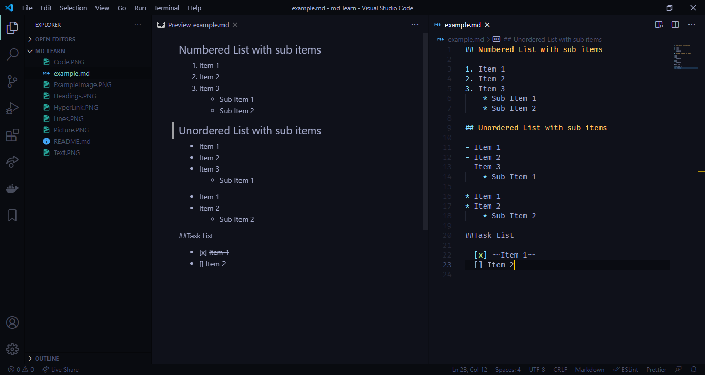

# Learn MD
How to create beautiful md files! You can use this file as a refrence when you want to create md files. 

## How to use this file

You can open this file in any code editor and see its content. If you want to preview md files, there are plenty of extensions to do so. For VSCode you can use keyboard shortcut Ctrl+Shift+V in the editor.

## Headings


## Hyperlink and images

You can use following syntax for creating a hyperlink:

[Link Text](Link)


You Can use following syntax for using a picture:


You can use both absolute and relative paths. 

## Text And Lines

You can type normal text. For new line you need to have one line in between if you have text in previous line.

You also can use text between two * for italic text, ** for bold, ~~ for strikethrough and > for quotes.


Use three dashes for a line and three * for a bold line.


**You can also use \ as escape character for using characters that markdown use for formatting.**

## Code in MD File

You can use ` for code and if you want a code block you can use ```:


## Lists

For creating list you can - or * for unordered list and numbered list with number and a dot after it. For Sub Items you have to use indentations with * afterwards.

For a Task List Use - with [] afterwards and use a x between [x] for checking it .



## Table
You can have tables in your markdown as well. Using tables in markdown is shown below:


 