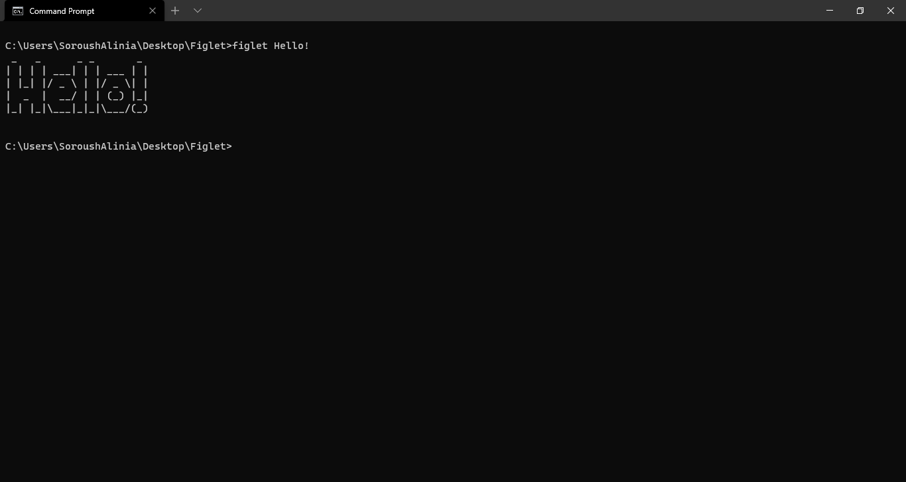

<!--Headings-->
# Headings 1
## Headings 2
### Heading 3
#### Headings 4
##### Headings 5
###### Headings 6

<!--Hyperlink and images-->

[Google](https://google.com)


<!--Texts and lines-->

Normal Text

*Italic Text*

**Bold Text**

~~Strikethrough Text~~

> Quote Text

## Text 1
---
## Text 2
***
## Text 3

<!--Code in MD File-->

`println!()` Inline code.

Rust:
```rust
fn main() {
    println!("Rust in md!");
}
```

JS:

```js
const print_msg() => {
    console.log("JS in md!");
}
```

<!--Lists-->

## Numbered List with sub items

1. Item 1
2. Item 2
3. Item 3
    * Sub Item 1
    * Sub Item 2

## Unordered List with sub items

- Item 1
- Item 2
- Item 3
    * Sub Item 1

* Item 1
* Item 2
    * Sub Item 2

##Task List
- [x] ~~Item 1~~
- [] Item 2

<!--Table-->

|Title 1  | Title 2 | Title 3
|--       | --      |---------
|Item 1   | Item 2  | Item 3